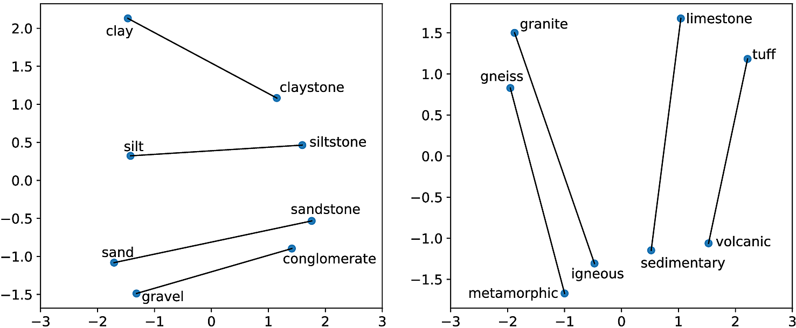
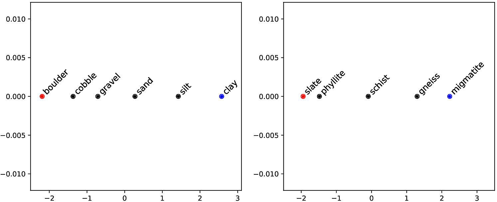

# GeoVec

This is the repository for the article "Word embeddings for application in geosciences: development, evaluation and examples of soil-related concepts" by José Padarian and Ignacio Fuentes from the University of Sydney.

## About

In this article we explore the use of word embeddings for geosciences. We trained a GloVe model using around 280,000 documents (mostly published scientific articles) in order to obtain domain-specific embeddings.

Reproducing the classic example that you can find online, bellow you can see two examples of relationships captured by the model. On the left, the relationship between soil particle fraction sizes and rocks. On the right, the relationship between rocks and rock types.



We also explored a less known property of the resulting latent vector space. We performed interpolations between words to test if we could obtain coherent results. Bellow you can see the results of two interpolation. On the left, the interpolation between two particle fraction sizes: coarse boulder and fine clay. The interpolation of the embeddings resulted in a gradient of particle sizes. On the right, a more advanced example showing a gradient of metamorphism grade between two rocks: slate and migmatite.



The results of the interpolation are quite impressive. Those word embeddings are "sorted" within the latent vector space following a natural property. Of course, the embeddings are derived from the corpus, so that means that the text is somehow describing that property.

## Usage

The word embeddings are stored in the [Open Science Framework](https://osf.io/) repository at [https://www.doi.org/10.17605/OSF.IO/4UYEQ](https://www.doi.org/10.17605/OSF.IO/4UYEQ).

The [HDF5](https://en.wikipedia.org/wiki/Hierarchical_Data_Format) file has two datasets. The word embeddings are contained in `vectors`. The embeddings were cast to `float32` in order to reduce the size of the files. As far as we know, that should not be a problem for most applications. If you need a `float64` copy, let us know. The dictionary of words used is contained in `dct`. The python dictionary was converted to JSON and then encoded to _utf-8_ before storing it in `dct`.

To load the data and create a `Glove` instance in python:

```python
import json

import h5py
import numpy as np
from glove import Glove

def load_geovec(path):
    instance = Glove()
    with h5py.File(path, 'r') as f:
        v = np.zeros(f['vectors'].shape, f['vectors'].dtype)
        f['vectors'].read_direct(v)
        dct = f['dct'][()].tostring().decode('utf-8')
        dct = json.loads(dct)
    instance.word_vectors = v
    instance.no_components = v.shape[1]
    instance.word_biases = np.zeros(v.shape[0])
    instance.add_dictionary(dct)
    return instance

new_model = load_geovec('geovec_300d_v1.h5')
```

## Open-access article

The open-access article has been accepted. You can visit the journal at:

https://www.soil-journal.net/5/177/2019/

or get a copy directly from:

[https://www.soil-journal.net/5/177/2019/soil-5-177-2019.pdf ](https://www.soil-discuss.net/soil-2018-44/soil-2018-44.pdf)

## How to cite this work?

### Embeddings

```
@misc{padarian2019geovec,
  title={GeoVec},
  url={https://osf.io/4uyeq},
  DOI={10.17605/OSF.IO/4UYEQ},
  publisher={OSF},
  author={Padarian, José and Fuentes, Ignacio},
  year={2019}
}
```

### Article

```
@article{padarian2019word,
  title={Word embeddings for application in geosciences: development, evaluation, and examples of soil-related concepts},
  author={Padarian, Jos{\'e} and Fuentes, Ignacio},
  journal={Soil},
  volume={5},
  number={2},
  pages={177--187},
  year={2019},
  publisher={Copernicus GmbH}
}
```
